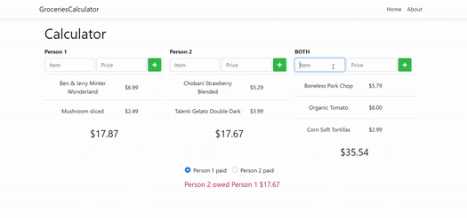
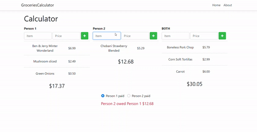
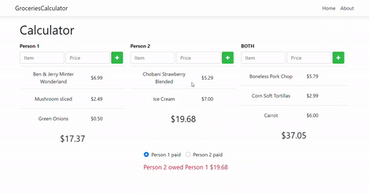

# [Groceries Calculator](http://SplitTheBill.oceara.com/)
> Quickly calculate how much you and your friend have spent, and how much one person owes

My best friend and I live in the same apartment, so we would go grocery shopping together every weekend. The receipts would consist of food that we both share such as ground beef and tomatoes, and food that only belongs to one of us like minted Ben & Jerry ice-cream (*Totally recommended if you haven't tried*). At the end of each trip, we would always have a receipt marked with three different colors: pink for shared food, orange for her food only, and yellow for my food only. Our receipts looked colorful, but they waste a lot of our time. We need a better way to quickly calculate how much each of us has spent after each grocery trip. 

That's how this project came to life! I hope this tool will not only help us but many others splitting money faster and more accurately. 

***Check out the website [here](http://SplitTheBill.oceara.com/) !***



## **Table of Contents**

 * [Usage](#usage)
 * [Development setup](#development-setup)
 * [Code scaffolding](#code-scaffolding)
 * [Build](#build)
 * [Contact me](#contact-me)
 * [Contributing](#contributing)

## **Usage**

#### Add new Item with Name (optional) and Price


#### Delete an Item


#### Who owes who 


## **Development setup**

This project was generated with [Angular CLI](https://cli.angular.io/) version 6.0.0.

Install the CLI using NPM ([Node.js](https://nodejs.org/en/) >= 10 required)

```shell
npm install -g @angular/cli@6.0.0 
```
In the project's folder. Restore all NPM packages by running

```shell
npm install
```
Run this command in the project's folder.

```shell
ng serve
```
 Navigate to `http://localhost:4200/`. The app will automatically reload if you change any of the source files.

## **Code scaffolding**

Run `ng generate component component-name` to generate a new component. You can also use `ng generate directive|pipe|service|class|guard|interface|enum|module`.

## **Build**

Run `ng build` to build the project. The build artifacts will be stored in the `dist/` directory. Use the `--prod` flag for a production build.

## **Contact me**

Heidi Tran – HeidiTran1410@gmail.com

## **Contributing**

1. Fork it (<https://github.com/HeidiTran/GroceriesCalculator/fork>)
2. Create your feature branch (`git checkout -b feature/fooBar`)
3. Commit your changes (`git commit -am 'Add some fooBar'`)
4. Push to the branch (`git push origin feature/fooBar`)
5. Create a new Pull Request
